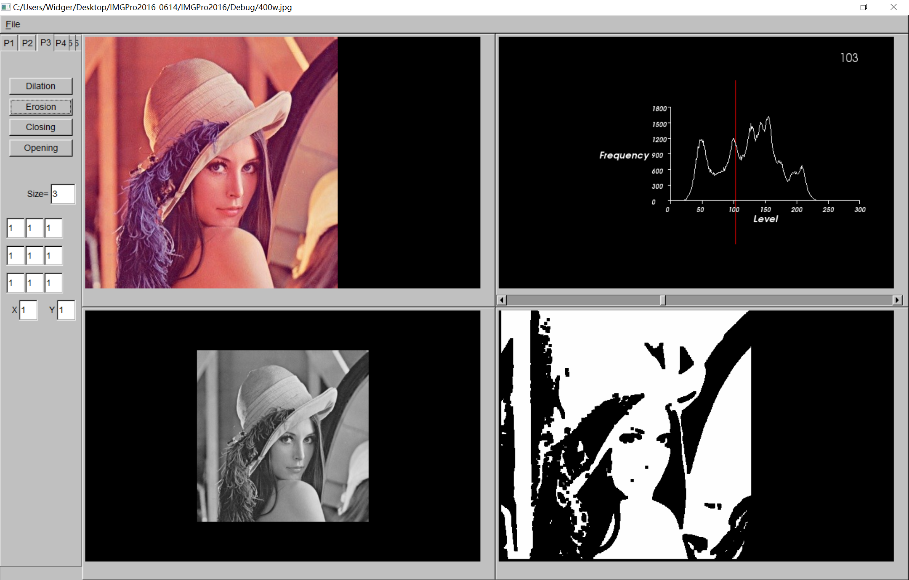

# IMGPro2016
This repository contains the original code for a image processing software based on VTK and FLTK libraries. It is used to display some classic image processing algorithms, such as image filtering, segmentation and edge detection algorithms.

